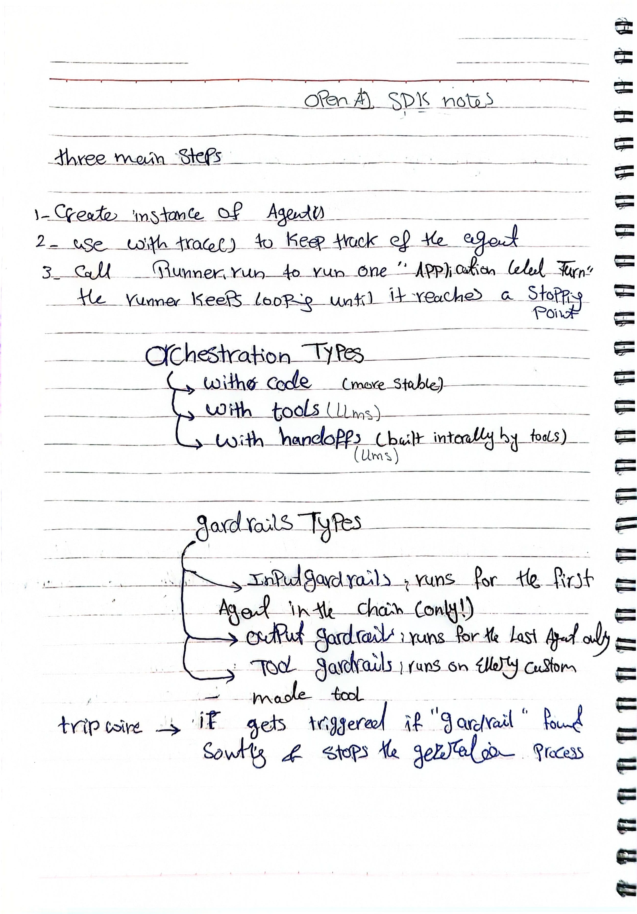

# Agent Orchestration & Guardrails

This section documents my notes and key takeaways while learning about **AI agents**.
## Original Handwritten Notes

These are my handwritten notes from studying **Agent Orchestration, Guardrails, and Tripwires**:

<p align="center">
  
</p>


## What I Learned

### Agent Orchestration

Agents can be coordinated in different ways depending on the workflow and level of control required:

- **Code** — Use application logic to control the agent workflow.
- **Tools** — Give the agent tools it can use to perform actions.
- **Handoffs** — Allow one agent to transfer a task to another specialized agent.

### Guardrails

Guardrails are used to control and validate agent behavior.

The main types I studied are:

- **Input Guardrails** — Validate or check user input before the agent processes it.
- **Output Guardrails** — Validate the agent's final response.
- **Tool Guardrails** — Control or validate how tools are used.

### Tripwires

A **tripwire** can stop an agent's execution when a guardrail is triggered.

This is useful when continuing execution could produce an invalid or unwanted result.

### Agent Execution

I also learned the basic idea of an agent repeatedly performing actions:

```text
User Request
     ↓
   Agent
     ↓
Decide what to do
     ↓
Use tools / perform actions
     ↓
Check conditions
     ↓
Continue or Stop
```

The agent can continue through multiple steps until it reaches a defined stopping condition.


## Key Takeaway

The main idea I took from this topic is that building an agent is not only about giving an LLM access to tools. **The orchestration layer determines how agents interact and execute tasks, while guardrails provide control over what the system is allowed to do.**

---

> These notes are part of my personal AI learning journal.
