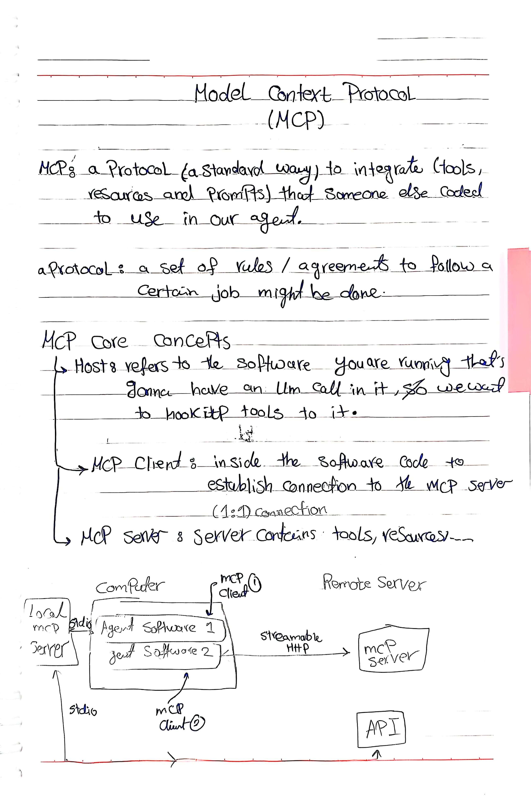
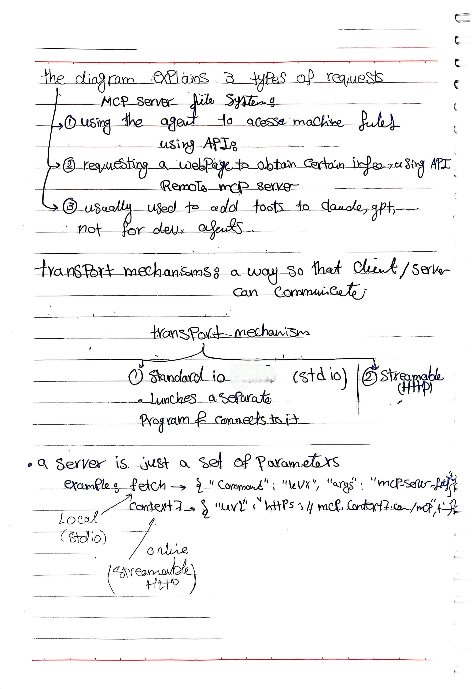
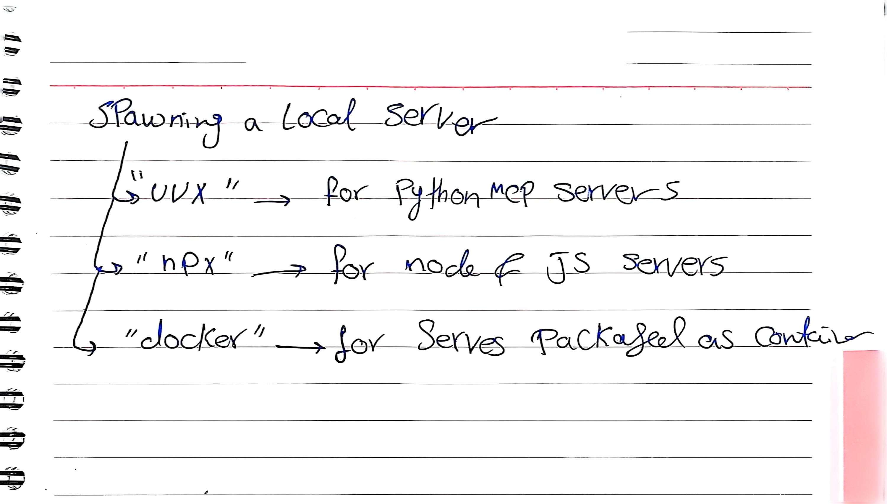

# Model Context Protocol (MCP)

A concise learning note on the **Model Context Protocol**: what it is, its core components, how clients and servers communicate, and how local servers are launched.

---

## Original Handwritten Notes

### Page 1

<p align="center">
  
</p>

### Page 2

<p align="center">
  
</p>

### Page 3

<p align="center">
  
</p>

---

## Summary

**MCP** is a protocol, meaning a standard way, to integrate **tools, resources, and prompts** that someone else has already built into our own agent.

A **protocol** is a set of rules or agreements that define how a certain job should be done. MCP applies this idea to connecting agents with external capabilities.

---

## Core Concepts

MCP has three main components:

- **Host:** the software being run that makes LLM calls and needs tools connected to it.
- **MCP Client:** lives inside the host's code and establishes the connection to an MCP server. Each client has a **1:1 connection** with one server.
- **MCP Server:** the server that provides the tools, resources, and prompts.

```text
Computer
┌─────────────────────────────────────────┐
│  Host: Agent Software 1  ── MCP Client 1 ──── stdio ────────► Local MCP Server ──► API
│  Host: Agent Software 2  ── MCP Client 2 ──── streamable HTTP ► Remote MCP Server
└─────────────────────────────────────────┘
```

---

## Three Typical Request Types

The diagram in the notes illustrates three kinds of requests:

1. **Local server, file system access:** the agent accesses files on the machine through an MCP server.
2. **Local server, API request:** the agent requests a web page through an API to obtain specific information.
3. **Remote MCP server:** commonly used to add tools to assistants such as Claude or ChatGPT.

---

## Transport Mechanisms

A **transport mechanism** is the way a client and a server communicate. MCP uses two:

| Transport | How it works | Typical use |
|---|---|---|
| **Standard I/O (stdio)** | The client launches a separate program on the machine and connects to it | Local servers |
| **Streamable HTTP** | The client connects to a server over HTTP | Remote (online) servers |

---

## Defining a Server

A server is just **a set of parameters**. The parameters depend on the transport.

**Local server (stdio)** — the client needs a command to launch it:

```json
{
  "command": "uvx",
  "args": ["mcp-server-fetch"]
}
```

**Remote server (streamable HTTP)** — the client only needs a URL:

```json
{
  "url": "https://mcp.context7.com/mcp"
}
```

---

## Spawning a Local Server

The `command` value depends on how the server is built and packaged:

| Command | Used for |
|---|---|
| `uvx` | Python MCP servers |
| `npx` | Node.js / JavaScript servers |
| `docker` | Servers packaged as containers |

---

## Key Takeaway

Using an MCP server does not require writing its tools yourself. The server is defined by a few parameters, and the **transport decides what those parameters are**: a launch command for a local stdio server, or a URL for a remote streamable HTTP server.

---

## Quick Reference

| Concept | Meaning |
|---|---|
| Host | The software running the LLM calls |
| MCP Client | Code inside the host that connects to one server (1:1) |
| MCP Server | Provides tools, resources, and prompts |
| stdio | Launches a local program and connects to it |
| Streamable HTTP | Connects to a remote server over HTTP |

---

> These notes are part of my personal AI learning journal.
