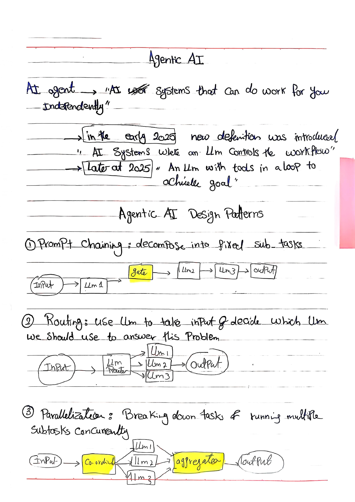
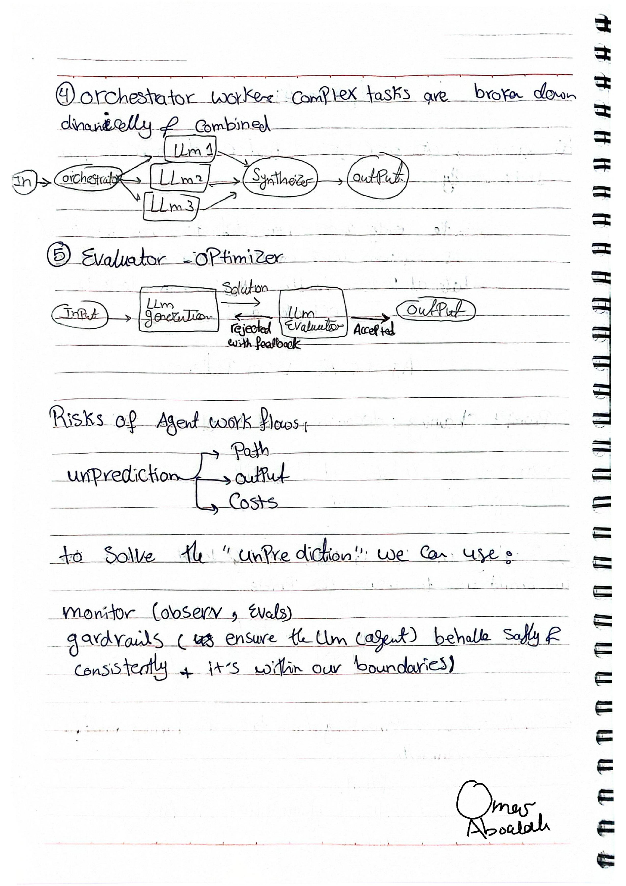

# Agentic AI — Design Patterns & Workflow Risks

A concise learning note on **Agentic AI**, common **agentic design patterns**, and the main risks that appear when LLMs are allowed to control parts of a workflow.

---

## Original Handwritten Notes

### Page 1

<p align="center">
  
</p>

### Page 2

<p align="center">
  
</p>

<p align="center">
  <a href="./Agentic_AI.pdf"><strong>📄 View / Download the original PDF</strong></a>
</p>

---

## Summary

An **AI agent** can be thought of as an AI system that can do work for you independently.

The notes highlight how the definition evolved during 2025:

- **Early 2025:** an AI system where an **LLM controls the workflow**.
- **Later in 2025:** an **LLM with tools in a loop to achieve a goal**.

The important shift is that the LLM is not only generating text  it can participate in deciding **what happens next** in the workflow.

---

## Agentic AI Design Patterns

### 1. Prompt Chaining

**Idea:** Decompose a task into a fixed sequence of subtasks.

```text
Input → LLM 1 → Gate → LLM 2 → LLM 3 → Output
```

Each model or step handles one part of the process before passing the result to the next stage.

**Key idea:** The workflow is mostly predetermined.

---

### 2. Routing

**Idea:** Use an LLM to inspect the input and decide which LLM should answer the problem.

```text
                  → LLM 1 ┐
Input → LLM Router → LLM 2 ├→ Output
                  → LLM 3 ┘
```

The router selects the most appropriate model or path based on the input.

**Key idea:** The path is selected dynamically.

---

### 3. Parallelization

**Idea:** Break a task into multiple subtasks and run them concurrently.

```text
                 → LLM 1 ┐
Input → Coordinator → LLM 2 ├→ Aggregator → Output
                 → LLM 3 ┘
```

The results from the parallel workers are then combined by an **aggregator**.

**Key idea:** Multiple subtasks can run at the same time instead of waiting for one another.

---

### 4. Orchestrator–Workers

**Idea:** Complex tasks are broken down dynamically and then combined.

```text
                 → LLM 1 ┐
Input → Orchestrator → LLM 2 ├→ Synthesizer → Output
                 → LLM 3 ┘
```

The **orchestrator** decides how the task should be split, sends work to different LLM workers, and a **synthesizer** combines their outputs.

**Key idea:** Unlike a fixed chain, the task breakdown itself can be dynamic.

---

### 5. Evaluator–Optimizer

**Idea:** One LLM generates a solution and another LLM evaluates it.

```text
Input → LLM Generation → Solution → LLM Evaluator
                                   ├→ Accepted → Output
                                   └→ Rejected with feedback → Generate again
```

If the solution is rejected, feedback is returned and the generation step is repeated.

**Key idea:** The system improves the result through an evaluation-and-feedback loop.

---

## Risks of Agent Workflows

Agent workflows introduce **unpredictability** in several areas:

```text
Unpredictability
├── Path
├── Output
└── Costs
```

### Path

The route the system takes may differ from one run to another.

### Output

The final result may vary even when the task is similar.

### Costs

Dynamic loops, multiple workers, and repeated evaluation can make the total cost harder to predict.

---

## Monitoring & Guardrails

The notes suggest two important ways to deal with this unpredictability:

### Monitoring

**Observe and evaluate** what the agent is doing during its workflow.

### Guardrails

Use constraints to help ensure the LLM or agent behaves **safely**, **consistently**, and **within defined boundaries**.

---

## What Clicked for Me

The main difference between these patterns is **how much of the workflow is fixed beforehand versus decided dynamically by the LLM**.

- **Prompt chaining** follows a fixed sequence.
- **Routing** dynamically chooses a path.
- **Parallelization** runs several subtasks together.
- **Orchestrator–workers** dynamically decides how a complex task should be divided.
- **Evaluator–optimizer** adds an iterative feedback loop to improve the output.

As the workflow becomes more dynamic, **monitoring, guardrails, and cost awareness become increasingly important**.

---

## Quick Reference

| Pattern | Main Purpose | Workflow Style |
|---|---|---|
| Prompt Chaining | Break a task into sequential steps | Fixed |
| Routing | Choose the best model/path for an input | Dynamic selection |
| Parallelization | Run independent subtasks together | Concurrent |
| Orchestrator–Workers | Dynamically divide complex work | Dynamic decomposition |
| Evaluator–Optimizer | Improve output through feedback | Iterative |

---

> These notes are part of my personal AI learning journal.
