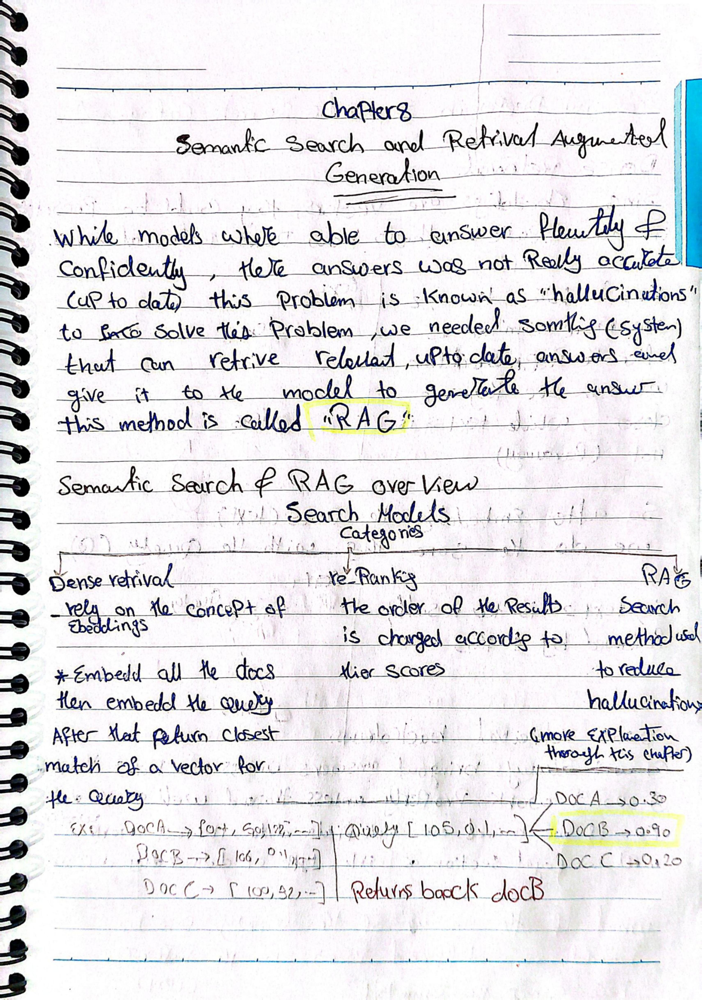
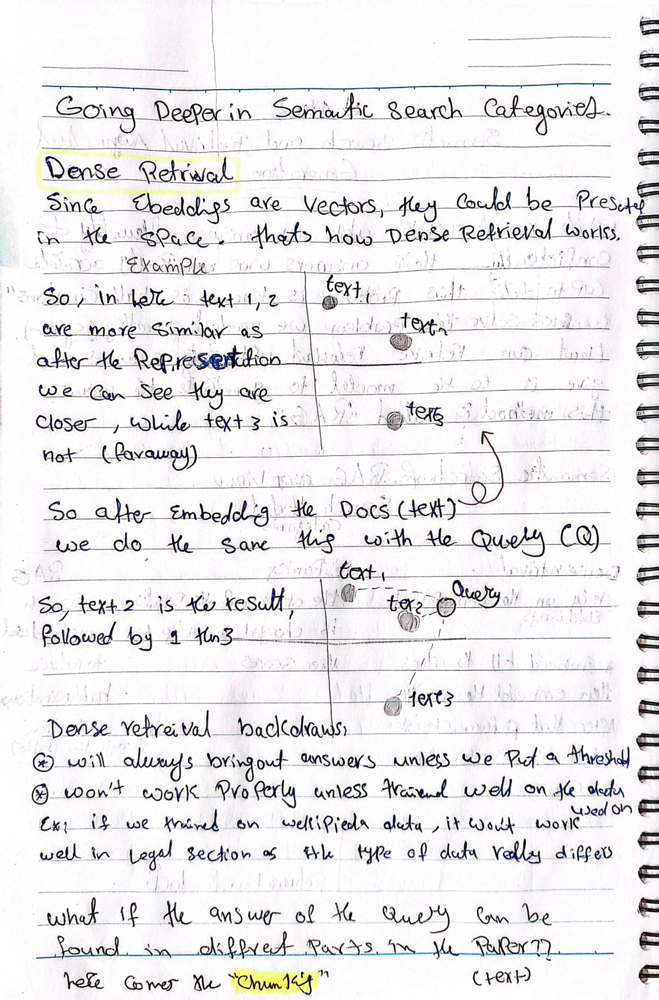
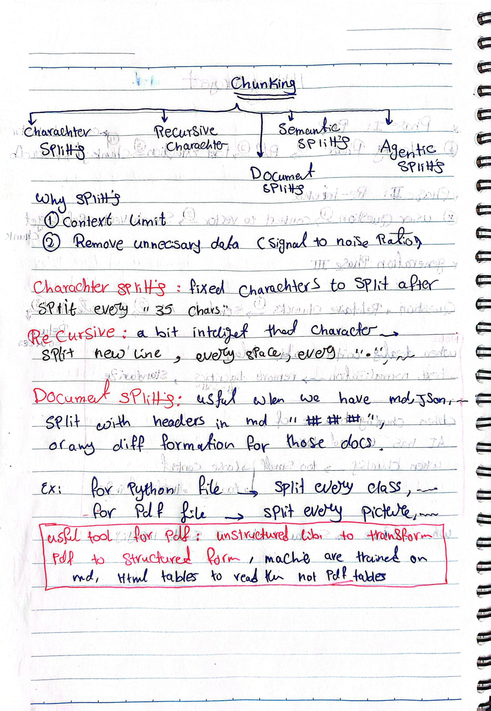
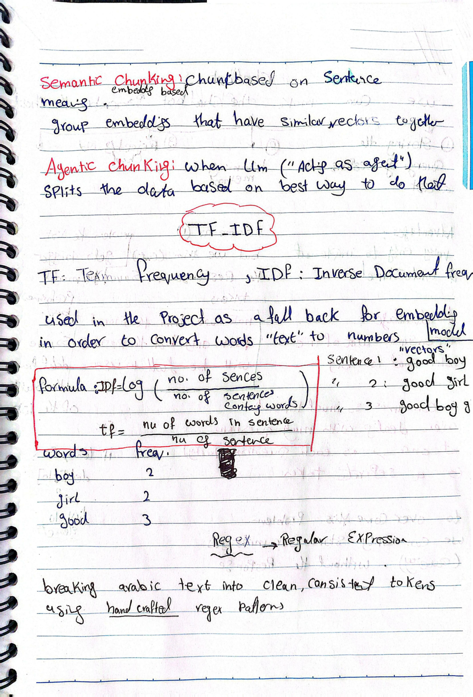
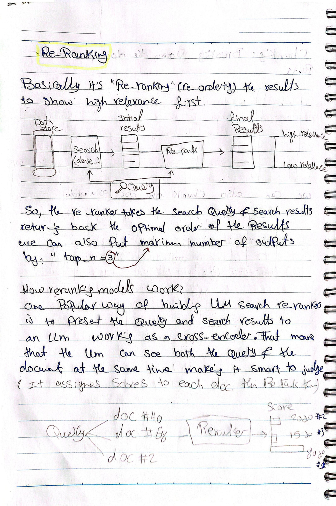
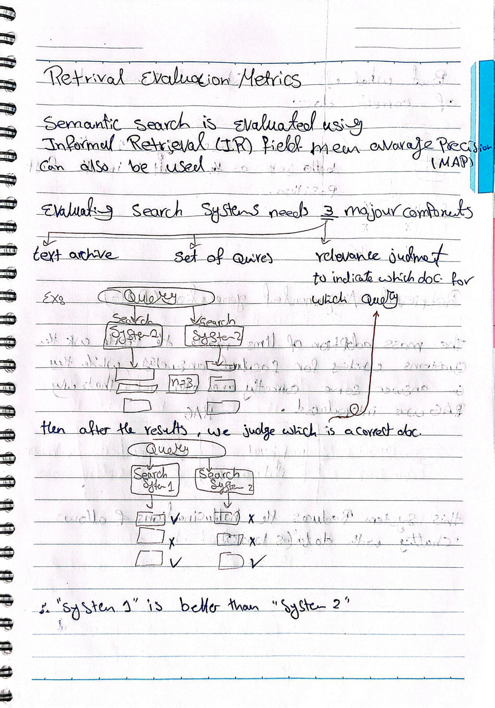
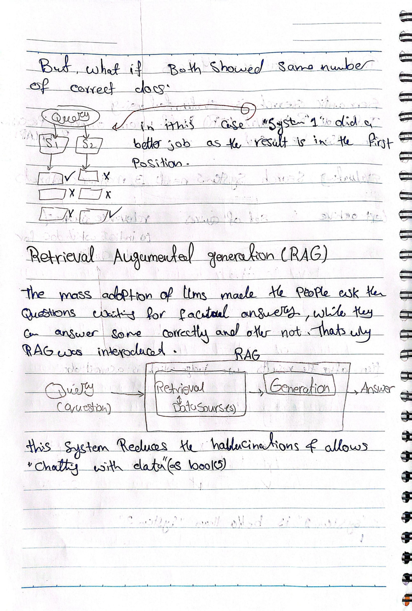
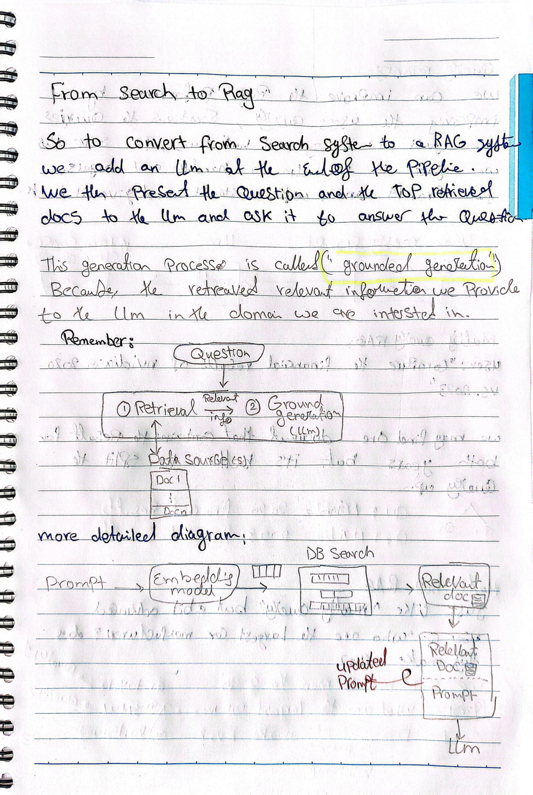
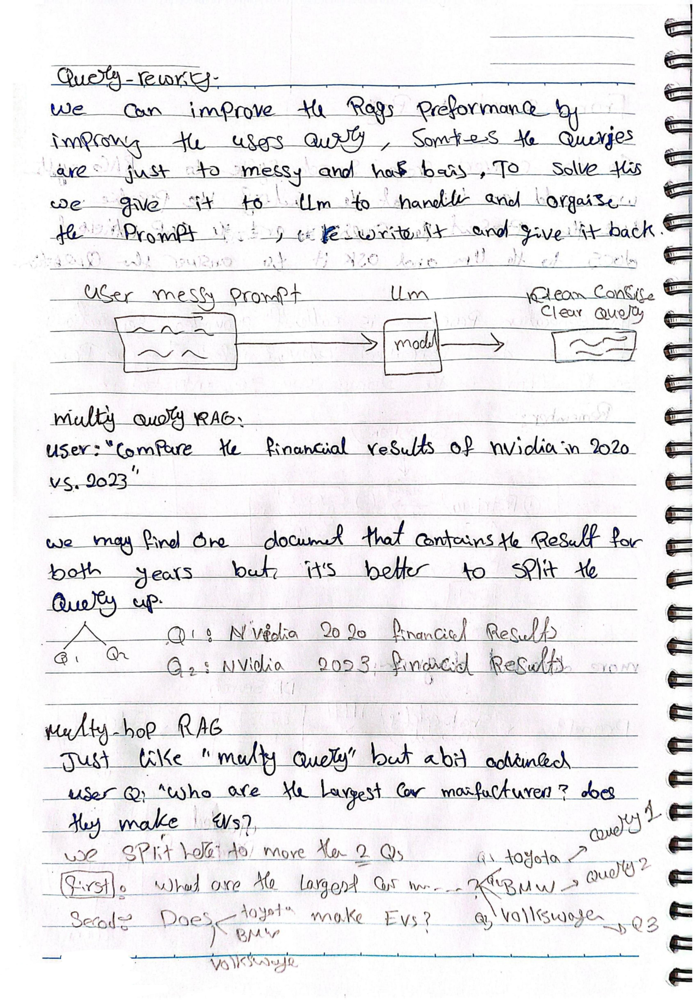

# Chapter 8 — Semantic Search and Retrieval-Augmented Generation

## Summary

Even when models can answer fluently and confidently, their answers aren't always accurate or up to date — this is the well-known problem of **hallucination**. This chapter covers how semantic search retrieves relevant information for a query, how chunking and re-ranking improve that retrieval, how retrieval quality gets evaluated, and finally how all of this feeds into **Retrieval-Augmented Generation (RAG)** — including more advanced patterns like query rewriting, multi-query RAG, and multi-hop RAG.

## Key Concepts

### Why RAG

Models can answer fluently and confidently, but that doesn't mean the answer is correct or current — this is the "hallucination" problem. To address it, we need a system that can retrieve relevant, up-to-date information and pass it to the model so it can generate its answer from that retrieved context. This combined method is called **RAG**.

### Semantic search and RAG — overview of search model categories

- **Dense retrieval** — relies on embeddings. All documents are embedded, then the query is embedded too, and the system returns the closest vector match(es) to the query.
- **Re-ranking** — re-orders an existing set of results according to a relevance score, refining a previously retrieved candidate list.
- **RAG (as a search method)** — the overall search method used to reduce hallucinations by grounding generation in retrieved content.

**Example of dense retrieval logic:** if Doc A scores 0.30 against the query, Doc B scores 0.90, and Doc C scores 0.20, the system returns Doc B, since it has the highest similarity score to the query.

### Going deeper into dense retrieval

Document embeddings are vectors, computed once ahead of time and stored. The key idea: once everything (documents and the query) is embedded into the same vector space, we can compare how close the query vector is to each document vector.

If text 1 and text 2 are very similar in meaning, their embeddings will land close together in the vector space; text 3, with a different meaning, will land further away. After embedding the documents, when we embed the query, we check which document embeddings sit closest to the query's embedding in that space — that's the result we return.

**Limitations:** dense retrieval won't always bring back accurate answers unless we put a threshold on similarity scores. It also doesn't inherently work well on structured data (like tables) unless that data is preprocessed or chunked in a way that matches its type.

### Chunking

Documents need to be split into smaller pieces before they're embedded. Reasons to chunk:

1. **Context limit** — a model or embedding system can only handle so much text at once.
2. **Removing unnecessary data** — improving the signal-to-noise ratio by not embedding irrelevant filler alongside useful content.

**Chunking strategies:**

- **Character splits** — splits text after a fixed number of characters (e.g., every 35 characters). Simple, not content-aware.
- **Recursive character splits** — a smarter version that tries to break at more natural points (new lines, spaces, punctuation) before falling back to a hard character limit.
- **Document splits** — useful for structured formats like Markdown or JSON, e.g. splitting Markdown by header level (`#`, `##`, `###`).
- **Semantic chunking** — embedding-based: chunks are formed around sentence *meaning* rather than fixed rules, by grouping together embeddings that have similar vectors.
- **Agentic chunking** — an LLM acts as an "agent" and decides how to split the data based on what it judges to be the best way to divide it, rather than following a fixed rule.

**Format-aware splitting examples:** for a Python file, split by class; for a PDF, split by image/figure boundaries. For PDFs specifically, the `unstructured` library can help transform PDF content into a more structured form — useful because many embedding models are trained on Markdown/HTML tables, not raw PDF table formatting, so PDF tables often don't get represented well without this kind of preprocessing.

### TF-IDF (a non-embedding fallback)

**TF-IDF** stands for **Term Frequency** (TF) and **Inverse Document Frequency** (IDF). In this project, it's used as a fallback for the embedding model — a way to convert words ("text") into numbers ("vectors") when a full embedding model isn't being used.

- **TF** = (number of times a word appears in a sentence) / (number of words in that sentence)
- **IDF** = log( (total number of sentences) / (number of sentences containing the word) )

**Example:** given three sentences — "good boy," "good girl," "good boy girl" — the word "good" appears in all 3 sentences (frequency 3), while "boy" and "girl" each appear in 2.

### Regex as a tokenization fallback

**Regex (Regular Expressions)** can be used to break Arabic text into clean, consistent tokens using hand-crafted pattern rules — another fallback approach for cases where a full tokenizer/embedding pipeline isn't available or practical.

### Re-ranking

Re-ranking means re-ordering a set of initial search results so the most relevant ones appear first. The flow: a data store is searched (e.g. via dense retrieval) to produce initial results → those results, along with the original query, are passed to a re-ranker → the re-ranker outputs a final, reordered list from highest to lowest relevance. You can also cap how many results come back using a parameter like `top_n` (e.g. `top_n = 3`).

**How re-ranking models work:** a common approach is to present the query and search results to an LLM acting as a **cross-encoder** — meaning the model can see both the query and the document at the same time, which makes it better at judging relevance than scoring them separately. The cross-encoder assigns a relevance score to each candidate document, and those scores determine the final ranking.

### Retrieval evaluation metrics

Semantic search systems are evaluated using metrics from the **Information Retrieval (IR)** field — **Mean Average Precision (MAP)** is one that can be used.

Evaluating a search system requires three major components:
1. **Text archive** — the collection of documents being searched.
2. **Set of queries** — the test questions used to evaluate the system.
3. **Relevance judgments** — labels indicating which documents are actually correct/relevant for which query.

**How comparison works in practice:** run the same query through two different search systems, then judge which of the returned documents are actually correct. If System 1 returns more correct documents than System 2 for the same query, System 1 is considered better.

**Edge case — tie-breaking by position:** if both systems return the same *number* of correct documents, the system that places the correct result in an earlier position (closer to the top) is considered to have done the better job, since users are more likely to look at top results first.

### Retrieval-Augmented Generation (RAG), in full

The mass adoption of LLMs led people to start asking them factual questions — and while models can answer some of these correctly, they get others wrong. RAG was introduced specifically to address this.

**Basic RAG pipeline:** Query (question) → Retrieval (search a data source) → Generation → Answer.

This system reduces hallucinations and effectively allows you to "chat with your data" (e.g. books or documents you provide).

**From search to RAG:** to turn a plain search system into a full RAG system, an LLM is added at the end of the pipeline. The top retrieved documents, along with the original question, are presented to the LLM, which is asked to answer the question using that retrieved context.

This generation step is called **grounded generation**, because the answer is "grounded" in the relevant information retrieved from the specific domain/data source you're interested in.

**More detailed pipeline view:** Prompt → Embedding model → DB search → Relevant document(s) retrieved → those documents are combined with the original prompt into an **updated prompt** → that updated prompt is passed to the LLM, which generates the final answer.

### Query rewriting

RAG performance can be improved by improving the user's query itself. Sometimes queries are messy or contain bias. To address this, the messy query is given to an LLM, which reorganizes and rewrites it into a clean, clear version before it's used for retrieval. Flow: user's messy prompt → LLM → clean, concise, clear query.

### Multi-query RAG

Some questions actually contain multiple distinct sub-questions bundled together. Example: *"Compare the financial results of Nvidia in 2020 vs. 2023."* While it's possible a single retrieved document might contain results for both years, it's generally better to split the query into separate sub-queries — e.g. Q1: "Nvidia 2020 financial results" and Q2: "Nvidia 2023 financial results" — and retrieve for each separately, then combine the results.

### Multi-hop RAG

This is similar to multi-query RAG, but more advanced — the sub-questions can depend on the *answers* to previous sub-questions, not just be independent splits of the original question.

**Example:** User asks: *"Who are the largest car manufacturers? Do they make EVs?"* This gets split into more than two questions, executed in sequence:
1. First: "What are the largest car manufacturers?" → answer: e.g. Toyota, BMW, Volkswagen.
2. Second: using that answer, ask follow-up questions per manufacturer — "Does Toyota make EVs?", "Does BMW make EVs?", "Does Volkswagen make EVs?"

So later queries in the chain depend on information retrieved by earlier ones, rather than all sub-queries being decided upfront.

## My Notes / What Clicked

The distinction between multi-query and multi-hop RAG was the most useful thing to nail down here: multi-query just splits one question into independent parts that could all be asked at once, while multi-hop only knows its later questions *after* getting answers to the earlier ones — it's a sequential, dependent chain rather than a parallel split. That's a meaningfully different system to build (multi-hop needs orchestration logic that waits on intermediate results).

## Original Handwritten Notes

View original pages

