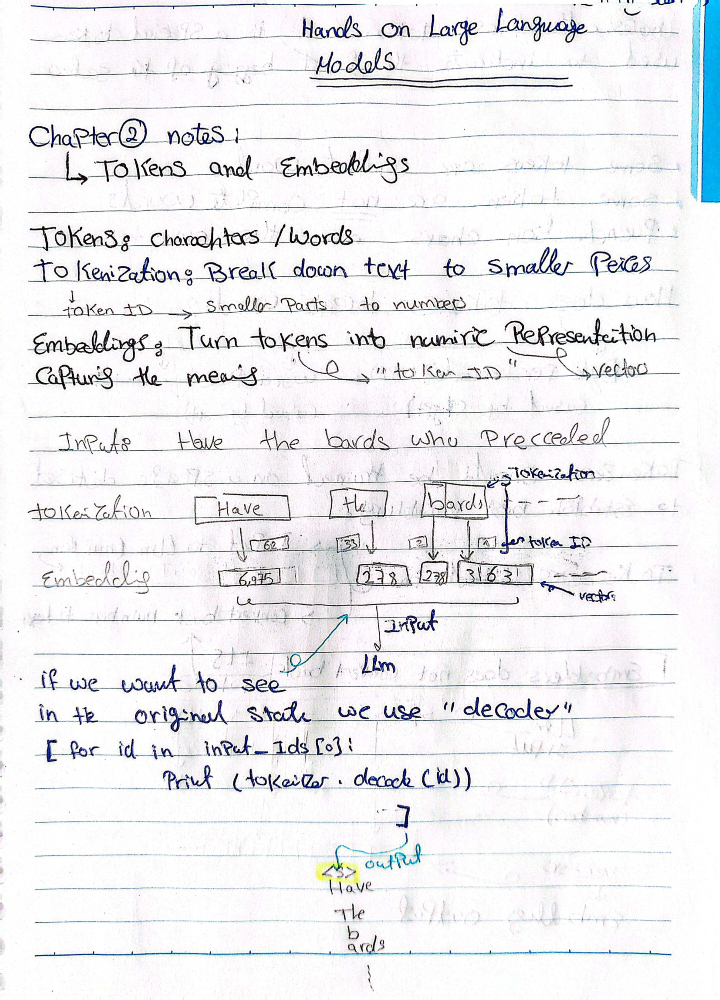
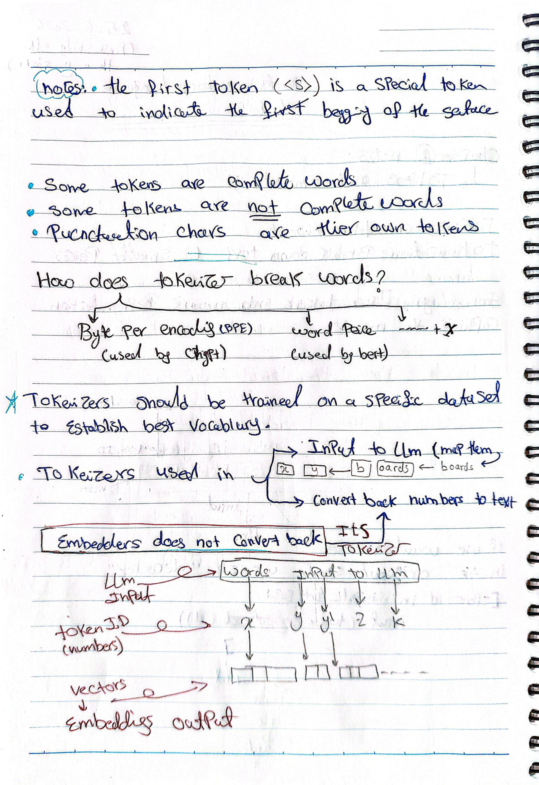
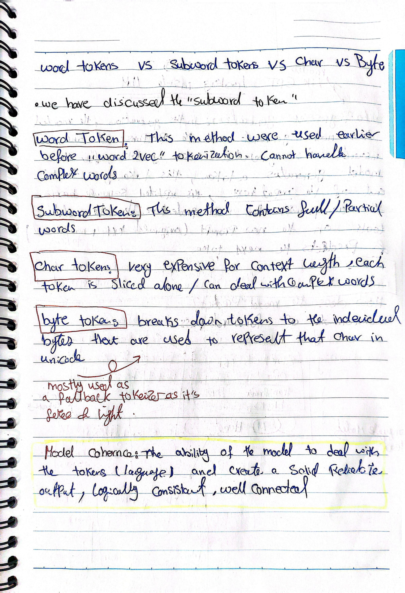

# Chapter 2 — Tokens and Embeddings

## Original Handwritten Notes

View original pages

## Summary

Before an LLM can process text, it has to break that text into smaller units (tokens) and convert each one into a numeric form (an embedding) that captures meaning. This chapter covers how tokenization and embedding work together to turn raw text into something a model can actually compute on, and how the model's output gets converted back into readable text.

## Key Concepts

**Tokens** are the basic units a model works with — they can be full words, parts of words, or individual characters, depending on the tokenizer.

**Tokenization** is the process of breaking text down into these smaller pieces and mapping each piece to a token ID (a number).

**Embeddings** turn token IDs into numeric vectors that capture meaning. Two tokens with similar meaning end up with vectors that are close to each other in this vector space.

**The pipeline:** input text → tokenizer breaks it into tokens and assigns token IDs → embedding layer turns each token ID into a vector → the LLM processes the sequence of vectors. To go back to human-readable text, a decoder maps token IDs back to their original text pieces (e.g. `tokenizer.decode(id)`).

**Special tokens**, like `<s>`, mark structural information — for example, the beginning of a sequence — rather than representing actual words.

### How tokenizers split words

There are a few different strategies, each with trade-offs:

- **Word tokens** — the older method (used before things like word2vec). Struggles with complex or rare words since every word needs its own slot in the vocabulary.
- **Subword tokens** — splits text into full or partial word pieces. This is the standard approach in modern LLMs.
- **Character tokens** — each character is its own token. Very expensive in terms of context length since a single word becomes many tokens, but handles any word, including unseen ones.
- **Byte tokens** — breaks tokens down into the individual bytes used to represent characters in Unicode. Mostly used as a fallback tokenizer since it can represent literally any input.

Two common subword tokenization algorithms: **Byte Pair Encoding (BPE)**, used by GPT-style models, and **WordPiece**, used by BERT.

Tokenizers need to be trained on a specific dataset to build a good vocabulary — a tokenizer trained on one domain or language won't necessarily split text well for another.

### Tokenizer vs. embedder

This distinction tripped me up at first, so it's worth being explicit:

- The **tokenizer** maps text → token IDs, and can also map token IDs back → text (it's reversible).
- The **embedder** maps token IDs → vectors, but this is **one-directional** — you can't go from an embedding vector back to the exact original token.

### Model coherence

A model's ability to take in tokenized language and produce output that is logically consistent, well-connected, and makes sense as a response — not just grammatically valid, but actually coherent given the input.

