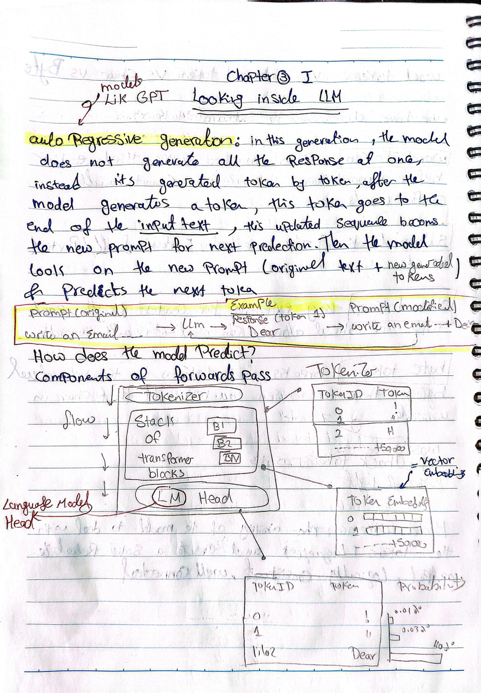
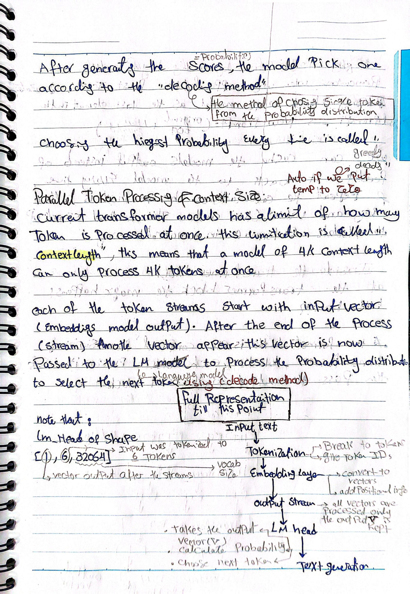
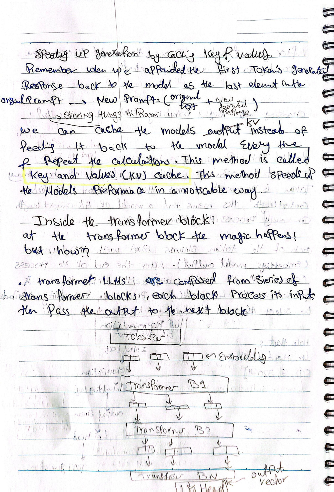
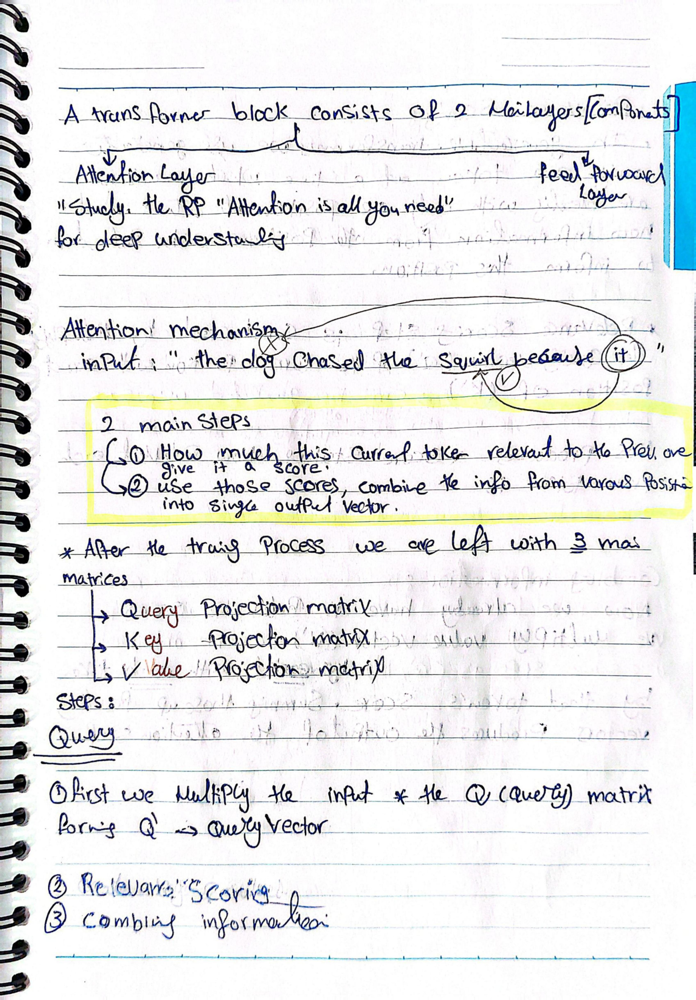
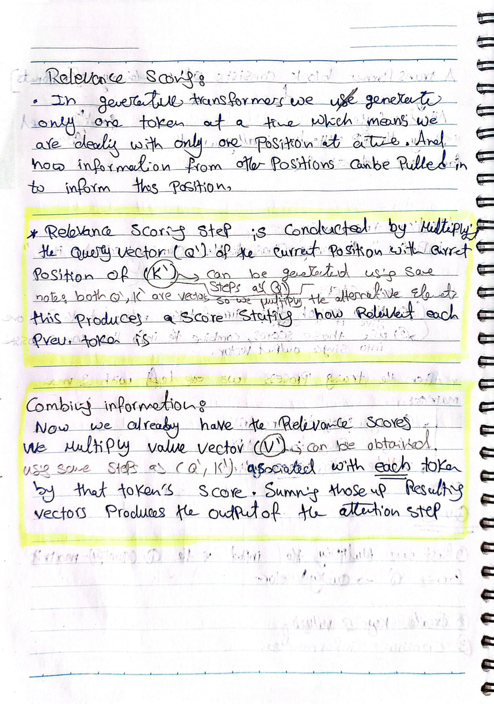
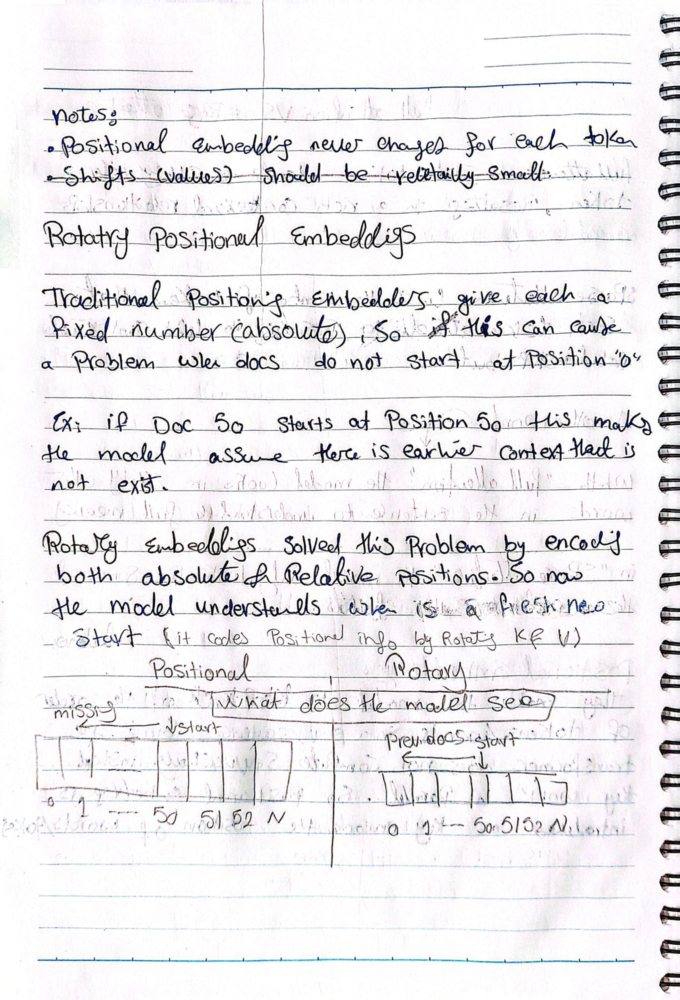

# Chapter 3 — Looking Inside LLMs

## Original Handwritten Notes

View original pages

## Summary

This chapter goes under the hood of GPT-like models to explain how a forward pass actually works: how a model generates one token at a time, what happens inside a transformer block, how attention lets tokens "look at" each other, and a few of the optimizations (KV caching, sparse attention, rotary embeddings) that make modern LLMs practical to run.

## Key Concepts

### Autoregressive generation

The model doesn't generate a full response in one shot. Instead, it generates one token at a time: after producing a token, that token is appended to the end of the input, and this updated sequence becomes the new prompt for predicting the *next* token. The model keeps looking at "original text + everything generated so far" at every step.

Example: prompt `"write an email..."` → model generates token `"Dear"` → new prompt becomes `"write an email... Dear"` → model predicts the next token from there, and so on.

### Components of a forward pass

Roughly, the flow is:

1. **Tokenizer** — text in, token IDs out.
2. **Token embeddings** — token IDs become vectors.
3. **Stack of transformer blocks** — the vectors are processed through many transformer blocks in sequence, each one passing its output to the next.
4. **LM head** (language model head) — takes the final vector output and converts it into a probability distribution over the entire vocabulary (i.e. a score for every possible next token).

### Choosing the next token (decoding)

Once the model has a probability distribution over the vocabulary, it needs a method to actually pick one token:

- **Greedy decoding** — always choosing the highest-probability token. This is what happens when temperature is set to 0 (fully deterministic).
- Other decoding methods exist (sampling with temperature, top-k, etc.) for more varied/creative output, though greedy was the main one covered here.

### Context length

Transformer models can only process a fixed number of tokens at once — this limit is called the **context length**. A model with a 4K context length can only process 4K tokens in a single pass. Every token stream starts as an input vector (from the embedding layer) and, after going through the full stack of transformer blocks, produces an output vector, which is then passed to the LM head to compute the next-token probability distribution.

Full pipeline summary: **input text → tokenization → embedding layer → transformer blocks (output stream) → LM head → next token → text generation.**

### Speeding up generation: KV caching

Because each new token requires reprocessing the entire updated prompt (original text + everything generated so far), naively this means recomputing a lot of the same calculations repeatedly. Instead, the model can **cache the key and value vectors** it already computed instead of recalculating them from scratch every time. This is called the **Key-Value (KV) cache**, and it speeds up generation noticeably.

### Inside the transformer block

A transformer LLM is made up of a series of transformer blocks stacked on top of each other — each block processes its input and passes the result to the next block.

Each transformer block has **two main sublayers**:

1. **Attention layer** — based on the "Attention Is All You Need" paper. This is where tokens exchange contextual information with each other.
2. **Feed-forward layer**.

### Attention mechanism

The core idea: for a sentence like *"The dog chased the squirrel because **it**..."*, the model needs to figure out what "it" refers to by looking back at earlier tokens.

Attention happens in **two main steps**:
1. Score how relevant each previous token is to the current token.
2. Use those relevance scores to combine information from various positions into a single output vector.

After training, the model ends up with three learned matrices:
- **Query projection matrix**
- **Key projection matrix**
- **Value projection matrix**

The steps, in order:
1. **Query** — multiply the input by the Query matrix to get a Query vector (Q) for the current token.
2. **Relevance scoring** — multiply the Query vector (Q) of the current position against the Key vectors (K) of previous positions (computed the same way, using the Key matrix). This produces a score for how relevant each previous token is.
3. **Combining information** — using those relevance scores, multiply each previous token's Value vector (V) by its score, then sum all of these weighted vectors together. The result is the output of the attention step for the current token.

This matters specifically for **generative/autoregressive transformers**, since the model only deals with one token (one position) at a time and needs a way to pull in information from all the positions that came before it.

### Full attention vs. sparse attention

- **Full attention** — every token attends to every other token, giving rich contextual relationships, but it's computationally expensive (scales badly with sequence length).
- **Sparse attention** — limits the number of tokens each token attends to, trading off some contextual richness for much lower computation cost.

In other words: full attention means the model looks at every word in the sentence to understand full meaning; sparse attention means it only looks at some of the words to save effort.

### Positional embeddings

Since transformers process tokens in parallel rather than sequentially (unlike older RNN-style models), they have no inherent sense of word order. **Positional embeddings** are added specifically to encode the position of each token/word in the sequence, so the model can keep track of order.

### Rotary positional embeddings (RoPE)

Traditional positional embeddings assign each token a fixed, absolute position number. This causes a problem when a document doesn't start at position 0 — e.g., if a document chunk starts at position 50, the model might incorrectly assume there's earlier context before it that doesn't actually exist.

**Rotary embeddings** solve this by encoding both **absolute and relative** position information, so the model correctly understands when a "fresh start" begins, regardless of the absolute position number.

A couple of notes on positional embeddings generally: they never change for a given token position, and the shifts/values involved should stay relatively small.

## My Notes / What Clicked

The KV cache idea took a re-read to fully click — the key insight is that without it, the model would be redoing the *same* Key/Value calculations for all the earlier tokens every single time it generates one new token, which is wasteful since those earlier tokens haven't changed. Caching just avoids that repeated work.
