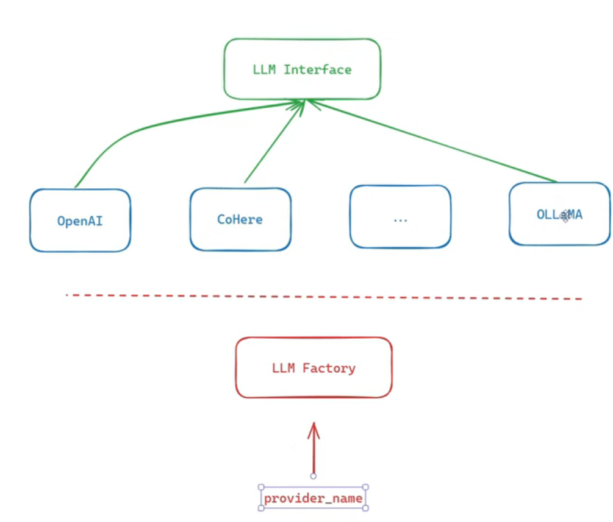

# LLM Providers & Backend Concepts

## Factory Pattern & LLM Providers

To keep the project durable long-term, we use the interface concept from OOP, so even if we swap between different LLM companies (OpenAI, Ollama, ...), they all expose the same functions.

The only difference is in the setup, handled through a design pattern called **Factory**. It's a class whose job is to create the right provider object for a given provider name (OpenAI, Cohere, ...), so the rest of the code never has to choose one itself.



In the `generate_text` function:

```python
def generate_text
```

Each provider may take its own generation arguments: some models need a prompt, some want a max_tokens value. So we include every argument we can think of, and when calling a specific provider, we only set the ones it actually uses and leave the rest at their default value.

For the function:

```python
def construct_prompt(self, prompt: str, role: str = None):
```

We reformat the prompt so it's compatible with whichever model we've chosen.

We can use the OpenAI client to talk to other providers too:

```python
from openai import OpenAI
```

This works for Ollama as well, but besides the key we also pass an extra `base_url` argument pointing to the Ollama server.

We use loggers to easily catch any fault or failure in the system.

**Code smell:** a pattern in the code that signals a deeper design problem (duplicated logic, functions doing too much, tight coupling), not just code that happens to be unused.

```python
raise NotImplementedError
```

Raises an error telling the caller this method isn't implemented yet. It is used as a placeholder in a base class, so every subclass is forced to provide its own version.

```python
text[:self.default_input_max_characters].strip()
```

`.strip()` removes leading and trailing spaces and newlines from the sliced text.

`LLMFactoryProvider.py` contains the Factory pattern that lets us easily create (choose) a provider from the available provider classes (`OpenAIProvider.py`, `CohereProvider.py`, ...).

## Lecture 16: Backend & Database Concepts

Forcing the output to be a dict (used to convert any object into JSON):

```python
return json.loads(
    json.dumps(collection_info, default=lambda x: x.__dict__)
)
```

**Locales** are a way to define language-specific resources (templates, messages, labels, prompts) without hard-coding them into the application. Every locale folder should follow the same structure and keys across languages. Only the translated values change.

**SQLAlchemy** is the library used to work with SQL in Python.

**UUID:** universally unique id. We use a random value for the id in production instead of incrementing it, so we don't reveal how many projects/records exist just from the id.

**JSONB (JSON Binary):** plain JSON is stored as a string and has to be parsed into an object every time it's read (slower reads). JSONB is stored in binary form instead, which costs more at write time but makes reads much faster.

**Indexing in SQL** makes searching faster. Instead of a linear scan (**O(n)**) through the whole table to find a row, an index (usually a tree-based structure) holds pointers straight to where each value lives. The database follows the pointer instead of scanning the table, turning the search into **O(log n)**.

**Data migration** is the process of moving data from one system, storage location, or format to another while preserving its accuracy, completeness, and usability.

**Alembic** is a migration tool for SQLAlchemy. It compares the SQLAlchemy models with the current database and generates migration scripts that create or update the tables to match the models. Running a migration applies those changes.

Alembic keeps these scripts as a versioned history, so a change can be rolled back to a previous version (downgrade).

In SQLAlchemy, `execute` runs a query, for both reads and writes. `commit` is only needed after writing data, to save the changes.
